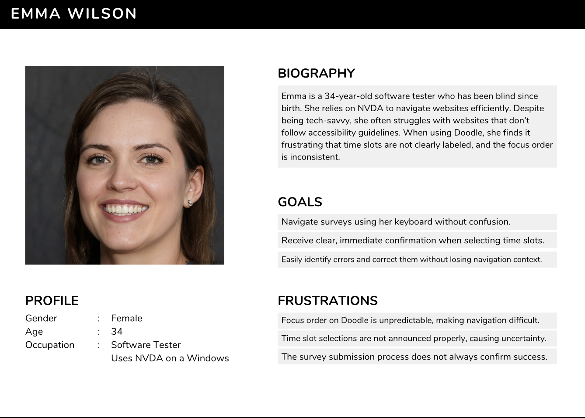
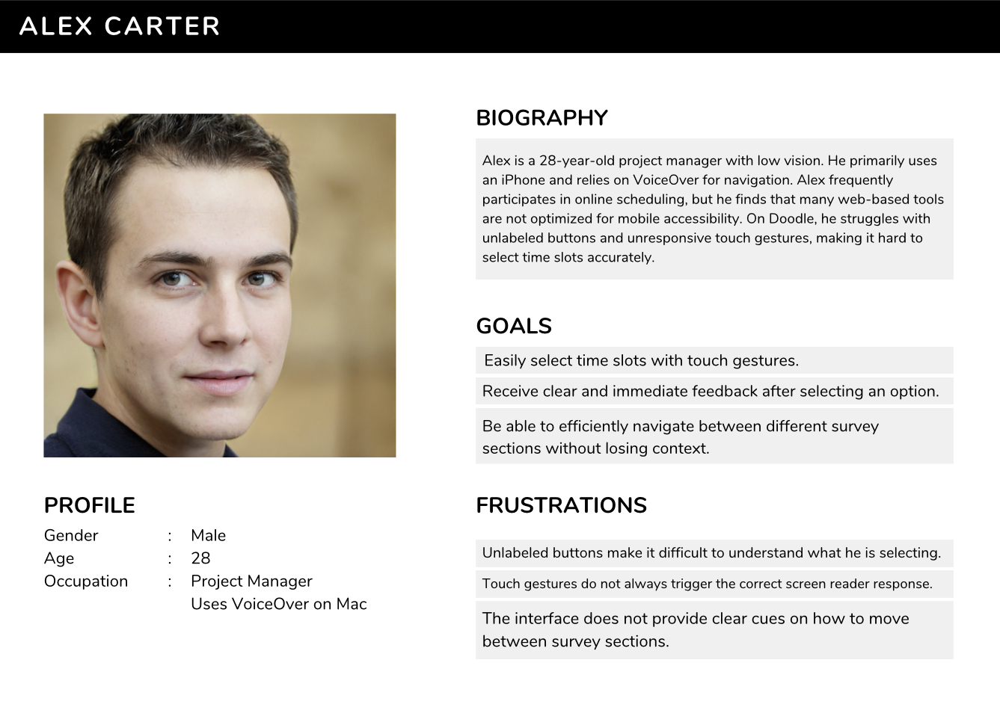
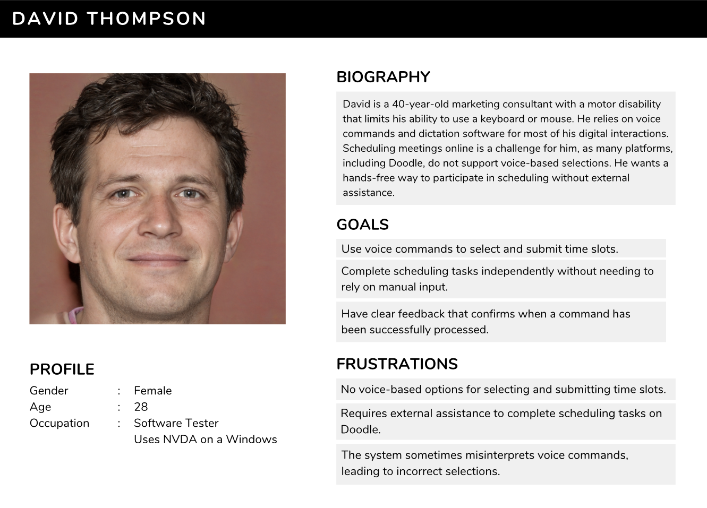

<br />
<div align="center">
  <h1 align="center">Functional Specifications</h1>
  <p align="center">
    <strong>Doodle Accessibility Enhancements for Screen Readers</strong>
    <br />
  
  </p>
</div>
<br />
<details>
<summary><b> 📖 Table Of Contents</b></summary>

1. [Introduction](#1-introduction)  
2. [Scope](#2-scope)  
3. [User Requirements](#3-user-requirements)  
   - [Primary Users](#31-primary-users)  
   - [Secondary Users](#32-secondary-users)  
4. [Functional Requirements](#4-functional-requirements)  
   - [Navigation Improvements](#41-navigation-improvements)  
   - [Checkbox and Form Selection Enhancements](#42-checkbox-and-form-selection-enhancements)  
   - [Improved Screen Reader Feedback](#43-improved-screen-reader-feedback)  
   - [Mobile Accessibility Enhancements](#44-mobile-accessibility-enhancements)  
   - [Voice Input for Future Expansion](#45-voice-input-for-future-expansion)  
5. [Target Audience](#5-target-audience)  
   - [Persona 1 - Emma (Blind User)](#51-persona-1---emma-blind-user)  
   - [Persona 2 - Alex (Mobile User)](#52-persona-2---alex-mobile-user)  
   - [Persona 3 - David (Hands-Free User)](#53-persona-3---david-hands-free-user)  
6. [Additional Considerations](#6-additional-considerations)  
   - [Security & Privacy](#61-security--privacy)  
   - [Browser & Device Compatibility](#62-browser--device-compatibility)  
   - [Performance Optimization](#63-performance-optimization)  
   - [Scalability & Future Enhancements](#64-scalability--future-enhancements)  
7. [Implementation Constraints](#7-implementation-constraints)  
   - [Technical Limitations](#71-technical-limitations)  
   - [Screen Reader & Accessibility Compatibility](#72-screen-reader--accessibility-compatibility)  
   - [Browser & Device Constraints](#73-browser--device-constraints)  
   - [Future-Proofing & Maintainability](#74-future-proofing--maintainability)  
8. [Defining Success](#8-defining-success)  
   - [Accessibility & Usability](#81-accessibility--usability)  
   - [Feedback & Confirmation](#82-feedback--confirmation)  
   - [Independence & Efficiency](#83-independence--efficiency)  
9. [Non-Functional Requirements](#9-non-functional-requirements)  
   - [Performance & Efficiency](#91-performance--efficiency)  
   - [Compatibility & Cross-Platform Support](#92-compatibility--cross-platform-support)  
   - [Security & Privacy](#93-security--privacy)  
   - [Maintainability & Scalability](#94-maintainability--scalability)  
   - [User Experience & Accessibility](#95-user-experience--accessibility)  
10. [Glossary](#10-glossary)  

</details>

## 1. Introduction

Doodle's current interface presents significant challenges for users relying on screen readers, particularly VoiceOver and NVDA. This document defines the functional requirements for improving accessibility, ensuring a smoother experience without modifying Doodle's core source code.

## 2. Scope

The project focuses on making Doodle more accessible by addressing navigation, labeling, feedback, and input methods. The implementation will use browser-side enhancements like scripts or extensions.

## 3. User Requirements

### 3.1. Primary Users

- Blind or visually impaired users using screen readers.


### 3.2. Secondary Users

- Users with motor impairments who prefer voice input.

- Users who want to complete surveys hands-free.

- Users who prefer voice commands for efficiency.

- Users who rely on keyboard navigation instead of a mouse.

- Mobile users who use VoiceOver (iOS) or TalkBack (Android).

## 4. Functional Requirements

### 4.1. Navigation Improvements

FR-1: Logical Focus Order

The system shall ensure a predictable focus order when using Tab and arrow keys.

Users shall not experience random jumps between elements.

FR-2: Keyboard-Only Interaction

Users must be able to select time slots and submit responses without requiring a mouse.

### 4.2. Checkbox and Form Selection Enhancements

FR-3: ARIA Labels for Checkboxes

Each checkbox must have an ```aria-label``` specifying the corresponding date and time.

Example: ```aria-label="Select Monday 3 PM"```.

FR-4: Live Feedback on Selection Changes

When a user selects or deselects a checkbox, a verbal announcement shall confirm the action.

Implemented using ```aria-live="polite"```.

### 4.3. Improved Screen Reader Feedback

FR-5: Descriptive Labels for Interactive Elements

Buttons, pop-ups, and key interactive components must have meaningful descriptions.

FR-6: Speech Synthesis for Confirmation Messages

When a selection is made, a synthesized voice should confirm the action.

Example: "Monday at 3 PM selected."

### 4.4. Mobile Accessibility Enhancements

FR-7: VoiceOver & TalkBack Optimization

Time slots must be properly announced when navigating via VoiceOver or TalkBack.

FR-8: Touch Navigation Improvements

Ensure touch-based interactions trigger proper screen reader responses.

### 4.5. Voice Input for Future Expansion

FR-9: Voice Command Selection 

Users shall be able to say "Select Monday at 3 PM" to check a time slot.

Implemented via Web Speech API.

FR-10: Voice-Controlled Submission 

Users shall be able to submit their choices with a voice command.

## 6. Target Audience

### 6.1. Persona 1 - Emma (Blind User)



### 6.2. Persona 2 - Alex (Mobile User)



### 6.3. Persona 3 - David (Hands-Free User)



## 7. Additional Considerations

The solution must be lightweight and compatible with modern browsers, ensuring that it does not interfere with Doodle’s core functionality. The deployment process should be simple and achievable through a browser extension or userscript.

### 7.1. Security & Privacy

The script must not store user data or require external servers. Ensure permissions are minimal (e.g., no unnecessary API access). Consider implementing local storage if user preferences need to be saved.

### 7.2. Browser & Device Compatibility

Must work on Chrome, Firefox, Edge, and Safari. Ensure proper functionality across desktop and mobile versions. Test with screen readers like NVDA, JAWS, and VoiceOver.

### 7.3. Performance Optimization

Minimize script execution time to prevent page slowdowns. Use event listeners efficiently to avoid excessive CPU usage. Ensure that updates are applied dynamically without page reloads.

### 7.4. Scalability & Future Enhancements

Should support additional accessibility features (e.g., Dark Mode, Contrast Mode). Potential integration with voice assistants (Google Assistant, Siri). Expand support for other scheduling platforms beyond Doodle.

## 8. Implementation Constraints

Since there is no access to Doodle’s backend or source code, all enhancements must be applied dynamically using browser-side scripting. This means the solution must operate without modifying Doodle’s core functionality, ensuring seamless integration without conflicts.

### 8.1. Technical Limitations

Enhancements rely on DOM manipulation, meaning updates to Doodle’s UI structure may require script adjustments.
Features must function without injecting new HTML elements that could interfere with Doodle’s layout. Browser-side scripting limits access to server-side validation, database interactions, and API modifications.

### 8.2. Screen Reader & Accessibility Compatibility

The solution must work reliably across:
- NVDA (Windows)
- JAWS (Windows)
- VoiceOver (macOS & iOS)
- TalkBack (Android)

Requires thorough testing with different browsers to ensure accessibility support.

### 8.3. Browser & Device Constraints

Must be compatible with modern browsers (Chrome, Firefox, Edge, and Safari). Needs to function both on desktop and mobile devices, considering differences in touch-based navigation.

### 8.4. Future-Proofing & Maintainability
Since Doodle may update its UI, the script should be easily modifiable for quick adaptations. Consider using CSS selectors and ARIA attributes dynamically, so changes in class names don’t break functionality. Future improvements could include browser extension support for more seamless deployment.

## 9. Defining Success

Success will be evaluated based on the following criteria:

#### 1️⃣ Accessibility & Usability

Users must be able to navigate Doodle fully via keyboard and screen readers (NVDA, JAWS, VoiceOver, TalkBack). Time slots should be clearly labeled and easy to select using voice commands or keyboard navigation.

#### 2️⃣ Feedback & Confirmation

The system must provide immediate audio feedback when a selection is made. Users should receive clear confirmation before submitting responses to prevent errors.

#### 3️⃣ Independence & Efficiency

Visually impaired users should be able to complete Doodle surveys independently without external assistance. The process should be as fast and intuitive as for sighted users, reducing frustration and improving accessibility.

##  10. Glossary

| Term | Definition |
|------|------------|
| **ARIA (Accessible Rich Internet Applications)** | A set of attributes that improve the accessibility of web content for screen reader users. |
| **ARIA Labels** | Descriptive text assigned to elements (e.g., buttons, checkboxes) to make them understandable to screen readers. |
| **ARIA Live Regions** | A mechanism to announce dynamic changes on a webpage (e.g., selection confirmation) without shifting focus. |
| **Focus Order** | The sequence in which elements are highlighted when navigating using the `Tab` key. |
| **Screen Reader** | Software that converts text into speech or braille output, commonly used by blind and visually impaired users (e.g., NVDA, VoiceOver, JAWS). |
| **Tab Navigation** | The ability to move through elements on a webpage using the `Tab` key. |
| **Web Speech API** | A technology enabling voice input and speech synthesis in web applications. |
| **VoiceOver & TalkBack** | Screen reader software for iOS (VoiceOver) and Android (TalkBack) that reads on-screen content aloud. |