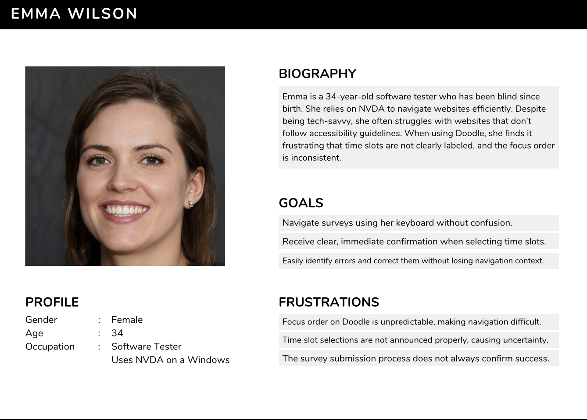
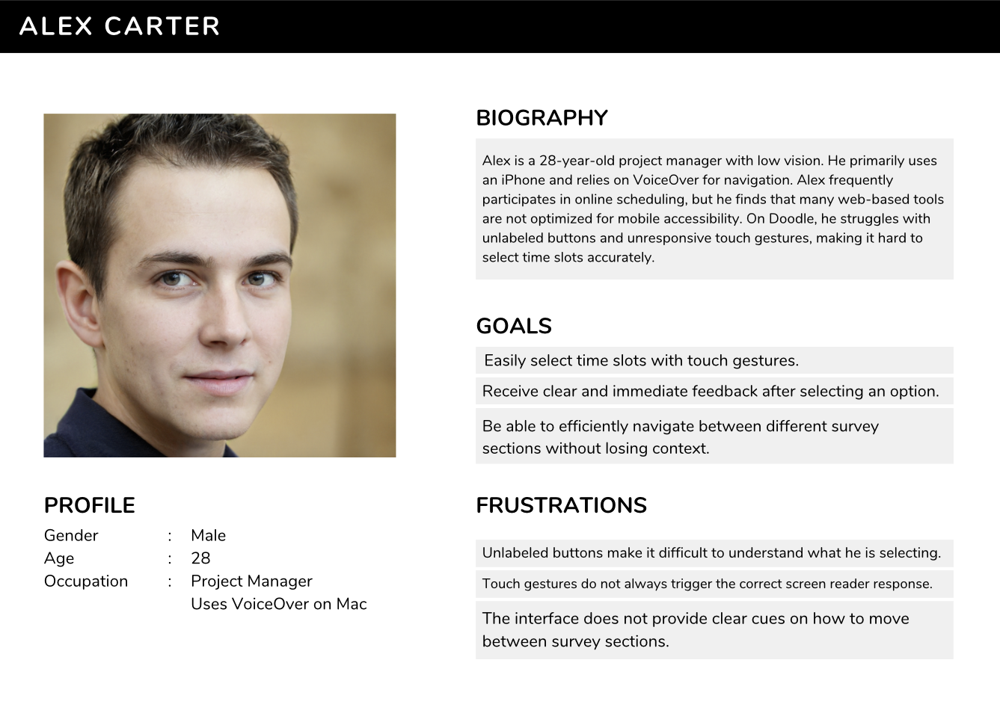

<br />
<div align="center">
  <h1 align="center">Moonshot Report</h1>
  <p align="center">
    <strong>Doodle Accessibility Enhancements for Screen Readers</strong>
    <br />
  
  </p>
</div>
<br />

<details>
<summary><b> 📖 Table Of Contents</b></summary>
 
 - [1. Project Overview](#1-project-overview)
- [2. Functional documentation](#2-functional-documentation)
  - [1. Scope](#1-scope)
  - [2. User Requirements](#2-user-requirements)
    - [2.1. Primary Users](#21-primary-users)
    - [2.2. Secondary Users](#22-secondary-users)
  - [3. Functional Requirements](#3-functional-requirements)
    - [3.1. Navigation Improvements](#31-navigation-improvements)
    - [3.2. Checkbox and Form Selection Enhancements](#32-checkbox-and-form-selection-enhancements)
    - [3.3. Improved Screen Reader Feedback](#33-improved-screen-reader-feedback)
    - [3.4. Mobile Accessibility Enhancements](#34-mobile-accessibility-enhancements)
    - [3.5. Voice Input for Future Expansion](#35-voice-input-for-future-expansion)
  - [4. Target Audience](#4-target-audience)
  - [5. Additional Considerations](#5-additional-considerations)
  - [6. Implementation Constraints](#6-implementation-constraints)
  - [7. Defining Success](#7-defining-success)
  - [8. Glossary](#8-glossary)
- [3. Technical documentation](#3-technical-documentation)
  - [1. Language and Voice Initialization](#1-language-and-voice-initialization-deep-dive)
  - [2. Speaking Text Aloud: speakText()](#2-speaking-text-aloud-speaktext-deep-dive)
  - [3. Triggering the Survey Flow: askUserDetails()](#3-triggering-the-survey-flow-askuserdetails-deep-dive)
  - [4. Collecting Identity: askForFullName()](#4-collecting-identity-askforfullname-deep-dive)
  - [5. Email Handling: checkAndConfirmEmail()](#5-email-handling-checkandconfirmemail-deep-dive)
  - [6. Naming the Survey: askForPurpose()](#6-naming-the-survey-askforpurpose-deep-dive)
  - [7. Optional Description Support: askForDescription()](#7-optional-description-support-askfordescription-deep-dive)
  - [8. Optional Location Input: askForLocation()](#8-optional-location-input-askforlocation-deep-dive)
  - [9. Time Slot Scheduling Flow](#9-time-slot-scheduling-flow-deep-dive)
  - [10. Parsing Day and Time Commands](#10-parsing-day-and-time-commands-deep-dive)
  - [11. Interacting with the Calendar Grid](#11-interacting-with-the-calendar-grid-deep-dive)
  - [12. Voice Command Trigger: enableVoiceCommands()](#12-voice-command-trigger-enablevoicecommands-deep-dive)
  - [13. Startup Behavior and Accessibility Enhancements](#13-startup-behavior-and-accessibility-enhancements-deep-dive)
- [4. Management](#4-management)
  - [Project Retroplanning](#project-retroplanning)
  - [Phase 1: Definition and Needs Analysis](#phase-1-definition-and-needs-analysis-march-1---march-10)
  - [Phase 2: Prototype and Preliminary Development](#phase-2-prototype-and-preliminary-development-march-11---april-7)
  - [Phase 3: Refinement & Internal Testing](#phase-3-refinement--internal-testing-april-8---may-5)
  - [Phase 4: User Testing & Iterations](#phase-4-user-testing--iterations-may-6---june-2)
  - [Phase 5: Finalization and Presentation Preparation](#phase-5-finalization-and-presentation-preparation-june-3---june-17)
  - [Phase 6: Final Presentation & Closure](#phase-6-final-presentation--closure-june-18---june-24)

</details>

# 1. Project Overview

This document outlines the functional and technical specifications for enhancing Doodle's accessibility for blind and visually impaired users, focusing on screen reader compatibility. The project aims to improve navigation, labeling, feedback, and input methods using browser-side enhancements like scripts or extensions.
# 2. Functional documentation

## 1. Scope

The project focuses on making Doodle more accessible by addressing navigation, labeling, feedback, and input methods. The implementation will use browser-side enhancements like scripts or extensions.

## 2. User Requirements

### 2.1. Primary Users

- Blind or visually impaired users using screen readers.


### 2.2. Secondary Users

- Users with motor impairments who prefer voice input.

- Users who want to complete surveys hands-free.

- Users who prefer voice commands for efficiency.

- Users who rely on keyboard navigation instead of a mouse.

- Mobile users who use VoiceOver (iOS) or TalkBack (Android).

## 3. Functional Requirements

### 3.1. Navigation Improvements

#### FR-1: Logical Focus Order

The system shall ensure a predictable focus order when using Tab and arrow keys.

Users shall not experience random jumps between elements.

#### FR-2: Keyboard-Only Interaction

Users must be able to select time slots and submit responses without requiring a mouse.

### 3.2. Checkbox and Form Selection Enhancements

#### FR-3: ARIA Labels for Checkboxes

Each checkbox must have an ```aria-label``` specifying the corresponding date and time.

Example: ```aria-label="Select Monday 3 PM"```.

#### FR-4: Live Feedback on Selection Changes

When a user selects or deselects a checkbox, a verbal announcement shall confirm the action.

Implemented using ```aria-live="polite"```.

### 3.3. Improved Screen Reader Feedback

#### FR-5: Descriptive Labels for Interactive Elements

Buttons, pop-ups, and key interactive components must have meaningful descriptions.

#### FR-6: Speech Synthesis for Confirmation Messages

When a selection is made, a synthesized voice should confirm the action.

Example: "Monday at 3 PM selected."

### 3.4. Mobile Accessibility Enhancements

#### FR-7: VoiceOver & TalkBack Optimization

Time slots must be properly announced when navigating via VoiceOver or TalkBack.

#### FR-8: Touch Navigation Improvements

Ensure touch-based interactions trigger proper screen reader responses.

### 3.5. Voice Input for Future Expansion

#### FR-9: Voice Command Selection 

Users shall be able to say "Select Monday at 3 PM" to check a time slot.

Implemented via Web Speech API.

#### FR-10: Voice-Controlled Submission 

Users shall be able to submit their choices with a voice command.

## 4. Target Audience

### 4.1. Persona 1 - Emma (Blind User)



### 4.2. Persona 2 - Alex (Mobile User)



### 4.3. Persona 3 - David (Hands-Free User)


## 5. Additional Considerations

The solution must be lightweight and compatible with modern browsers, ensuring that it does not interfere with Doodle’s core functionality. The deployment process should be simple and achievable through a browser extension or userscript.

### 5.1. Security & Privacy

The script must not store user data or require external servers. Ensure permissions are minimal (e.g., no unnecessary API access). Consider implementing local storage if user preferences need to be saved.

### 5.2. Browser & Device Compatibility

Must work on Chrome, Firefox, Edge, and Safari. Ensure proper functionality across desktop and mobile versions. Test with screen readers like NVDA, JAWS, and VoiceOver.

### 5.3. Performance Optimization

Minimize script execution time to prevent page slowdowns. Use event listeners efficiently to avoid excessive CPU usage. Ensure that updates are applied dynamically without page reloads.

### 5.4. Scalability & Future Enhancements

Should support additional accessibility features (e.g., Dark Mode, Contrast Mode). Potential integration with voice assistants (Google Assistant, Siri). Expand support for other scheduling platforms beyond Doodle.

## 6. Implementation Constraints

Since there is no access to Doodle’s backend or source code, all enhancements must be applied dynamically using browser-side scripting. This means the solution must operate without modifying Doodle’s core functionality, ensuring seamless integration without conflicts.

### 6.1. Technical Limitations

Enhancements rely on DOM manipulation, meaning updates to Doodle’s UI structure may require script adjustments.
Features must function without injecting new HTML elements that could interfere with Doodle’s layout. Browser-side scripting limits access to server-side validation, database interactions, and API modifications.

### 6.2. Screen Reader & Accessibility Compatibility

The solution must work reliably across:
- NVDA (Windows)
- JAWS (Windows)
- VoiceOver (macOS & iOS)
- TalkBack (Android)

Requires thorough testing with different browsers to ensure accessibility support.

### 6.3. Browser & Device Constraints

Must be compatible with modern browsers (Chrome, Firefox, Edge, and Safari). Needs to function both on desktop and mobile devices, considering differences in touch-based navigation.

### 6.4. Future-Proofing & Maintainability
Since Doodle may update its UI, the script should be easily modifiable for quick adaptations. Consider using CSS selectors and ARIA attributes dynamically, so changes in class names don’t break functionality. Future improvements could include browser extension support for more seamless deployment.

## 7. Defining Success

Success will be evaluated based on the following criteria:

#### 1️⃣ Accessibility & Usability

Users must be able to navigate Doodle fully via keyboard and screen readers (NVDA, JAWS, VoiceOver, TalkBack). Time slots should be clearly labeled and easy to select using voice commands or keyboard navigation.

#### 2️⃣ Feedback & Confirmation

The system must provide immediate audio feedback when a selection is made. Users should receive clear confirmation before submitting responses to prevent errors.

#### 3️⃣ Independence & Efficiency

Visually impaired users should be able to complete Doodle surveys independently without external assistance. The process should be as fast and intuitive as for sighted users, reducing frustration and improving accessibility.

##  8. Glossary

| Term | Definition |
|------|------------|
| **ARIA (Accessible Rich Internet Applications)** | A set of attributes that improve the accessibility of web content for screen reader users. |
| **ARIA Labels** | Descriptive text assigned to elements (e.g., buttons, checkboxes) to make them understandable to screen readers. |
| **ARIA Live Regions** | A mechanism to announce dynamic changes on a webpage (e.g., selection confirmation) without shifting focus. |
| **Focus Order** | The sequence in which elements are highlighted when navigating using the `Tab` key. |
| **Screen Reader** | Software that converts text into speech or braille output, commonly used by blind and visually impaired users (e.g., NVDA, VoiceOver, JAWS). |
| **Tab Navigation** | The ability to move through elements on a webpage using the `Tab` key. |
| **Web Speech API** | A technology enabling voice input and speech synthesis in web applications. |
| **VoiceOver & TalkBack** | Screen reader software for iOS (VoiceOver) and Android (TalkBack) that reads on-screen content aloud. |

# 3. Technical documentation


### 1. Language and Voice Initialization (Deep Dive)

At the core of the script lies a multilingual voice interaction system powered by the **Web Speech API**. The system needs to handle multiple voices, dynamic loading delays (especially in Chrome), and adapt seamlessly between French and English users.

```js
let selectedLang = 'fr-FR';
let availableVoices = [];
```

#### Why This Matters:
- Different users have different default browser language settings.
- Voice names and availability differ across browsers and OS platforms.
- Chrome, in particular, can delay loading voices until after a `speechSynthesis.speak()` call.

#### Initialization Flow:
1. **Default Language**: The default is set to `fr-FR` so that French prompts and voices are prioritized, especially important for accessibility in a bilingual context.
2. **Voice List Fetching**: The browser provides voice data via `speechSynthesis.getVoices()`. This list can be empty at first, so the script ensures it listens to the `onvoiceschanged` event to refresh `availableVoices` once voices are ready.
3. **Voice Selection Logic** (covered in `speakText()`): When a prompt is spoken, the script filters `availableVoices` to match the desired language and chooses a preferred voice (e.g., `Google français`, `Amelie`, etc.).

#### Resilience and Adaptability:
- The script avoids hard-coding a single voice name to ensure compatibility across systems.
- If no preferred voice is found, it gracefully defaults to any matching-language voice.
- All speech synthesis calls are delayed slightly via `setTimeout` to accommodate async voice loading.

#### Benefits:
- Ensures immediate voice feedback in the user's preferred language.
- Avoids crashes or silences from missing voice profiles.
- Supports toggling language mid-session with minimal delay.

---

### 2. Speaking Text Aloud: `speakText()` (Deep Dive)

This function is the engine for all spoken prompts in the tool. It takes a text string and uses the browser’s **speech synthesis** capabilities to read it aloud. It handles voice preferences, error recovery, and callback continuation.

```js
function speakText(text, callback) { ... }
```

#### Voice Selection Strategy:
- **Language-based Filtering**: Voices are filtered by the active language setting (`fr-FR` or `en-US`).
- **Preferred Names Priority**: In French mode, it tries to pick known reliable voices (e.g., `Daniel`, `Flo`, `Amelie`). In English, it picks any valid `en-US` voice.
- **Fallback Behavior**: If no preferred voice is found, the script uses the first voice that matches the selected language.

#### Robust Execution:
- **Avoiding Double-Speak**: The function checks `speechSynthesis.speaking` to prevent overlapping utterances.
- **Error Recovery**: If the speech fails on the first try, it retries once after a short delay.
- **Cross-Browser Considerations**: Voices can load late in Chrome, so the function refreshes them before every utterance.

#### Callback Support:
A key feature is the optional `callback` parameter:
- Executed when the utterance finishes.
- Enables chaining voice actions with logic (e.g., prompt → listen → prompt again).

#### Example Use Case:
```js
speakText('Quel est votre prénom ?', () => startSpeechRecognition());
```

This ensures the system does not begin listening until the speech prompt is fully spoken, providing a smooth and accessible user experience.

---

### 3. Triggering the Survey Flow: `askUserDetails()` (Deep Dive)

This function is the entry point for launching the voice-controlled survey creation process. It ensures the interaction adapts depending on the user's authentication status.

```js
function askUserDetails() { ... }
```

#### Purpose:
- To **initiate** the voice-based interaction.
- To determine whether to **ask for user identity** or **skip to survey setup** based on login state.

#### How It Works:
1. **Check login state**:
   - The script looks for existing values in the name or email input fields.
   - If those are pre-filled (user already logged in), it skips identity collection.
2. If **not logged in**, the script proceeds to:
   - Prompt the user for first and last name (via `askForFullName()`).
   - Then check or collect email (via `checkAndConfirmEmail()`).
3. Once user info is confirmed, it proceeds to the next step: asking for the survey purpose.

#### Logic Tree:
```text
IF user is logged in:
    → Skip identity questions
ELSE:
    → askForFullName() → checkAndConfirmEmail()
→ askForPurpose()
```

#### Language Awareness:
- Prompts are dynamically selected based on the current `selectedLang`.
- For example:
  - English: "What is your first name?"
  - French: "Quel est votre prénom ?"

#### Benefits:
- **Efficient branching**: Users don’t waste time repeating what’s already known.
- **User-friendly**: Makes onboarding smoother by avoiding redundant prompts.
- **Scalable**: This branching approach could be extended to other steps as well.

#### Limitations:
- If the email or name input structure changes on Doodle’s side, detection might fail.
- May need future improvements for user error recovery (e.g., repeating steps or restarting the flow).

---

### 4. Collecting Identity: `askForFullName()` (Deep Dive)

This function handles voice-based input for collecting **first and last names**, providing a seamless and accessible user identification process.

```js
function askForFullName(callback) { ... }
```

#### Purpose:
- To prompt the user for their **first name** and then their **last name**.
- To fill in the full name field(s) on the Doodle form using speech recognition results.

#### How It Works:
1. The function speaks a prompt (e.g., “What is your first name?”) using `speakText()`.
2. It starts speech recognition and listens for a response.
3. Once a name is detected, the function:
   - Stores it.
   - Moves on to the next name part (last name).
4. When both names are received, it combines and fills them into the corresponding input field(s).

#### Resilience:
- If speech is unclear or silence is detected, the script may repeat the prompt.
- It attempts to gracefully handle edge cases (e.g., retrying or allowing a manual fallback).

#### Language Support:
- The spoken prompts and expected answers adapt based on the `selectedLang` setting.
- Supports nuanced differences like “Quel est votre prénom ?” in French or “What’s your first name?” in English.

#### Known Limitations:
- **Speech recognition errors**: Common French surnames (e.g., “Leroy”) can be misinterpreted (“le roi”).
  - Future enhancements could include fuzzy matching or spelling confirmation logic.
- Works best with a clear microphone and user pronunciation.

#### Benefits:
- Fully voice-based: no typing required.
- Tied directly into the form logic, ensuring continuity with subsequent questions.
- Lays the groundwork for skipping login steps if the name is already present in the DOM.

This function is a building block for full voice-controlled interaction, ensuring the user is personally identified before creating a survey.


---

### 5. Email Handling: `checkAndConfirmEmail()` (Deep Dive)

This function ensures that the user’s email is accurately filled in before proceeding. It handles both retrieval from existing inputs and capturing a new value through voice recognition if needed.

```js
function checkAndConfirmEmail(callback) { ... }
```

#### Purpose:
- To **validate** and **fill in** the user’s email address.
- To offer confirmation if an email is already provided.
- To collect and store an email if none exists.

#### How It Works:
1. **Email already present**:
   - If the email field is already filled (e.g., user is logged in), the script reads it aloud for confirmation.
   - The user is prompted to confirm (e.g., "Do you want to use this email?").
2. **No email present**:
   - The user is prompted to dictate their email address.
   - The response is validated and written into the email input field.
3. **Persistence**:
   - The confirmed email is saved in `localStorage` to be reused in future sessions.

#### Sample Flow:
```text
Email field is empty:
→ "What is your email address?" (recorded)
→ "You said example@domain.com, is that correct?" (confirmation)
→ (writes value to field and stores in localStorage)
```

#### Language Support:
- Prompts are adapted to the current voice language (French or English).
- For example:
  - English: "Please provide your email address."
  - French: "Veuillez fournir votre adresse e-mail."

#### Advantages:
- **Personalized**: Remembers emails across sessions, reducing repetition.
- **Failsafe**: Offers validation and confirmation to avoid incorrect input.
- **Voice-first**: Keeps everything in a natural spoken flow.

#### Challenges:
- **Speech Recognition Accuracy**: Email addresses can be tricky for voice recognition.
  - Future improvement: spelling mode ("a as in apple") could reduce errors.
- **Field availability**: Relies on proper detection of the email field in the DOM.

This function strengthens the onboarding process by ensuring that communication with the user remains consistent, proactive, and mindful of prior entries—while enhancing convenience through memory and confirmation mechanisms.


---

### 6. Naming the Survey: `askForPurpose()` (Deep Dive)

The `askForPurpose()` function is responsible for gathering the main title or objective of the group survey. This is typically the first required input for creating a Doodle survey, and the script treats it as a critical step in the voice-driven flow.

```js
function askForPurpose() { ... }
```

#### Purpose:
- To **prompt the user for the subject** or purpose of the group meeting.
- To **fill in the title field** of the survey form using the user’s voice input.

#### How It Works:
1. The function uses `speakText()` to prompt the user:
   - English: “What is the group survey for?”
   - French: “Quel est l'objet du sondage de groupe ?”
2. Speech recognition is activated and listens for the user’s response.
3. Once captured, the input is directly inserted into the Doodle title field (`[data-testid="title-input"]`).
4. After successfully filling the title, the flow proceeds to the next step (e.g., description).

#### Example Voice Flow:
```text
→ "What is the group survey for?"
← "Team brainstorming session"
→ (Title field is filled with "Team brainstorming session")
```

#### Considerations:
- **Timing**: The function must allow enough time for the user to respond after the voice prompt. This is carefully managed using callbacks from `speakText()`.
- **Field validation**: It assumes the presence of the Doodle title field and may log a warning if it is not found.
- **Language flexibility**: Prompts and field behaviors switch dynamically depending on the current language (`fr-FR` or `en-US`).

#### Benefits:
- **Streamlined Entry**: Lets users get started quickly without touching the keyboard.
- **Natural Interaction**: Encourages speech-first UX by placing the "title" step early.
- **Modular Integration**: Can be reused or invoked as part of a larger multi-step voice workflow.

#### Limitations:
- **Error correction**: There is currently no retry mechanism if the input was misunderstood.
- **Field mismatch**: If Doodle changes its internal HTML structure, field selectors may need updates.

This function creates a fluid and intuitive transition between user identification and content creation, ensuring that the most essential information—the purpose of the meeting—is captured naturally and efficiently.


---

### 7. Optional Description Support: `askForDescription()` (Deep Dive)

The `askForDescription()` function handles an optional but valuable input: adding descriptive context to the group survey. By making this step optional and clearly communicating that to the user, the script supports both minimal and detailed survey creation workflows.

```js
function askForDescription() { ... }
```

#### Purpose:
- To **ask users if they want to add more details** to the group survey.
- To **capture and insert the spoken description** into the appropriate description textarea on the Doodle form.

#### How It Works:
1. The function prompts the user via `speakText()`:
   - English: “Would you like to add more details?”
   - French: “Souhaitez-vous ajouter plus de détails ?”
2. It listens for a yes/no response using speech recognition.
3. If the user responds affirmatively (e.g., "yes", "oui"), another voice prompt is triggered to capture the description content.
4. Once captured, the description is inserted into the designated textarea: `textarea[data-testid="description-textarea"]`.
5. If the user declines, the flow continues to the next step.

#### Example Voice Flow:
```text
→ “Would you like to add more details?”
← “Yes”
→ “Please describe the survey.”
← “This is a brainstorming session for the Q3 roadmap.”
→ (Description field is filled)
```

#### Considerations:
- **Optional Handling**: Responds to both affirmative and negative inputs without breaking flow.
- **Fallback Safety**: If no description field is found, the script logs a warning.
- **Language Adaptability**: Both the prompt and the interpretation of user answers are localized (EN/FR).

#### Benefits:
- **Flexibility**: Gives users control over how much context they want to provide.
- **Accessibility**: Eliminates the need for typing out long paragraphs.
- **Efficient Workflow**: Skips unnecessary input when the user declines.

#### Limitations:
- **No Undo**: Once input is inserted, the script doesn’t support undoing or revising by voice.
- **Recognition Dependency**: Requires reliable speech recognition to understand longer responses.

The `askForDescription()` step adds nuance to the user interaction and provides richer context for group participants, all while respecting user autonomy and accessibility needs.


---

### 8. Optional Location Input: `askForLocation()` (Deep Dive)

The `askForLocation()` function is responsible for collecting optional location details from the user if they choose to provide them. Like the description step, this field is non-mandatory, and the function respects the user's decision.

```js
function askForLocation() { ... }
```

#### Purpose:
- To **prompt the user for a physical or virtual location** where the meeting will take place.
- To **insert the user’s voice input** into the location input field on the form.

#### How It Works:
1. The script first uses `speakText()` to ask the user:
   - English: “Would you like to specify a location?”
   - French: “Souhaitez-vous indiquer un lieu ?”
2. The user’s yes/no answer is processed using voice recognition.
3. If the answer is affirmative:
   - A follow-up prompt is triggered to ask for the location.
   - The user's answer is inserted into the input field: `input[placeholder*="Lieu"]` or equivalent based on detected language.
4. If the user says no, the script proceeds directly to the next interaction step.

#### Example Voice Flow:
```text
→ “Would you like to specify a location?”
← “Yes”
→ “Please say the location.”
← “Conference Room B, third floor”
→ (Location field is filled)
```

#### Considerations:
- **Selector Flexibility**: The input field is located via partial placeholder matching, ensuring compatibility with localized UI versions.
- **Prompt Localization**: Voice prompts and user intent parsing are both multilingual.
- **Error Handling**: Logs a warning if the location field is missing or not found in the DOM.

#### Benefits:
- **Customizable Scheduling Context**: Users can add context like room number, Zoom link, or general place.
- **Accessibility-Driven**: Makes it possible to specify detailed logistics hands-free.
- **Workflow Integrity**: The process is skipped cleanly if the user opts out.

#### Limitations:
- **Input Field Detection**: Relies on placeholder keywords, which may change with Doodle UI updates.
- **No Re-Prompting**: Does not currently allow users to revise the location once spoken.

The `askForLocation()` step completes the optional detail-gathering phase of the group survey, enabling users to define "where" as well as "what" and "why"—all through natural, multilingual voice input.


---

### 9. Time Slot Scheduling Flow (Deep Dive)

After gathering the basic and optional details for the survey, the script moves into the scheduling phase where users define available time slots for the group meeting. This is a multi-step process facilitated by a series of functions.

```js
function askForTimeSlots() { ... }
function selectDuration() { ... }
function askForDateTimeSlot() { ... }
```

---

#### Purpose:
- To determine whether the user wants to define specific time slots.
- To collect time-related preferences through voice.
- To translate spoken information into interactive actions on the Doodle calendar grid.

---

#### How It Works:

1. **askForTimeSlots():**
   - Prompts the user to confirm if they’d like to add time slots.
   - Depending on the response, the script either moves forward or concludes the form-filling flow.

2. **selectDuration():**
   - If time slots are desired, the script asks for the **duration** of each slot.
   - Accepts input like “30 minutes,” “1 hour,” or “2 hours.”
   - The parsed duration is stored and used in the subsequent slot entry logic.

3. **askForDateTimeSlot():**
   - Prompts the user to name a day and a time (e.g., “Tuesday at 3 PM”).
   - Uses the helper `parseDateCommand()` to extract structured information.
   - Triggers UI actions through `selectSlotByDayAndTime()` which simulates clicking the corresponding slot on the Doodle grid.

---

#### Example Voice Flow:
```text
→ “Would you like to propose available time slots?”
← “Yes”
→ “For how long should each slot last?”
← “1 hour”
→ “Please provide a time slot.”
← “Thursday at 2 PM”
→ (Slot is visually selected on the calendar)
```

---

#### Considerations:
- **Multilingual Prompts**: All interaction steps are provided in both French and English.
- **Slot Matching**: Date and time parsing must accurately align with available cells in Doodle’s grid.
- **Flexible Duration**: Accepts varied duration formats and units.

---

#### Benefits:
- **Natural Scheduling**: Allows users to describe schedules conversationally.
- **Seamless Integration**: Bridges parsed input and real UI actions with simulated clicks.
- **Repeatable Interaction**: Can be looped or extended to add multiple slots.

---

#### Limitations:
- **Input Precision**: Misheard times or ambiguous phrases may cause misalignment.
- **No Confirmation Step**: Once a slot is added, it is not reviewed or confirmed by the user.

The time slot scheduling flow converts voice input into calendar actions, helping users define availability through intuitive, spoken instructions—greatly enhancing the accessibility and speed of the group organization process.


---

### 10. Parsing Day and Time Commands (Deep Dive)

Once a user provides a time slot verbally (e.g., "Thursday at 2 PM"), the script needs to extract structured data—such as the day of the week and the hour—from the spoken input. This parsing is handled by the `parseDateCommand()` function.

```js
function parseDateCommand(text) { ... }
```

---

#### Purpose:
- To transform natural language expressions into usable scheduling data.
- To support multi-language (French and English) inputs with flexible phrasing.
- To interface correctly with Doodle's internal slot selection system.

---

#### How It Works:

1. **Input Normalization**:
   - The spoken input (e.g., "jeudi à 14 heures") is first converted to lowercase.
   - Accents and punctuation are removed for easier pattern matching.

2. **Day Extraction**:
   - The function looks for keywords that match days of the week.
   - For example, “Monday” or “lundi” will be mapped to a short format like `mon`, `tue`, `wed`, etc.

3. **Time Recognition**:
   - The script searches for numerical values and time expressions.
   - It handles both 12-hour and 24-hour clock formats (e.g., “2 PM” or “14 heures”).
   - Also supports fuzzy input like “around 3,” "three o’clock," or "quatorze heures."

4. **Return Format**:
   - Returns an object like `{ dayShort: 'thu', hourInt: 14 }`, which is later used to interact with the calendar.

---

#### Example Voice Input:
```text
User says: “Jeudi à 15 heures”
Parsed result: { dayShort: 'thu', hourInt: 15 }
```

---

#### Multilingual Capabilities:
- **French**: Handles terms like “lundi,” “mardi,” “heures,” “à,” and “vers.”
- **English**: Recognizes standard day and time expressions such as “Tuesday at 3 PM.”

---

#### Benefits:
- **Flexibility**: Accepts a wide variety of input styles from users.
- **Localization**: Designed to handle French and English seamlessly.
- **Clarity**: Cleanly separates day and hour, ensuring compatibility with UI logic.

---

#### Limitations:
- **No Range Support**: Doesn’t currently handle intervals like “between 2 and 4 PM.”
- **Ambiguities**: Phrases like “this evening” or “tomorrow morning” aren’t supported yet.

---

#### Why It Matters:
This function forms the backbone of the natural interaction flow, turning spoken availability into meaningful selections within Doodle's scheduling grid.


---

### 11. Interacting with the Calendar Grid (Deep Dive)

To convert user-selected day and time into visible interaction on the Doodle interface, the script uses simulated clicks on grid cells. This is done by two functions: `simulateSlotClick()` and `selectSlotByDayAndTime()`.

```js
function simulateSlotClick(dayIndex, hour) { ... }
function selectSlotByDayAndTime(dayShort, hourInt) { ... }
```

---

#### Purpose:
- To simulate user interaction with the calendar.
- To visually reflect spoken time slot selections on the Doodle grid.
- To ensure keyboard- and voice-only users can create valid surveys.

---

#### `simulateSlotClick()` – How It Works:

1. **Identify Grid Target**:
   - Calculates the correct pixel position of a time slot on the grid.
   - Uses `document.elementFromPoint()` to find and focus the cell.

2. **Triggering Click**:
   - A `MouseEvent` is constructed and dispatched to simulate the actual user click.
   - This triggers any client-side Doodle behavior as if a real user had clicked.

3. **Scroll Correction**:
   - The grid is scrolled into view to ensure clicks are not lost off-screen.

---

#### `selectSlotByDayAndTime()` – How It Works:

1. **Map Day Abbreviation**:
   - Converts short day formats (`mon`, `tue`, etc.) into grid column indices.

2. **Validate Hour**:
   - Ensures the hour is within Doodle's valid scheduling range (typically 0–23).

3. **Delegation**:
   - Calls `simulateSlotClick()` with computed indices to execute the selection.

---

#### Example:
```js
selectSlotByDayAndTime('wed', 14); // Clicks Wednesday at 2PM
```

---

#### Benefits:
- **Visual Feedback**: Voice-selected slots appear instantly on-screen.
- **No DOM Assumptions**: Relies on rendered positions rather than class names or IDs.
- **Flexible**: Works regardless of screen resolution or layout shifts.

---

#### Limitations:
- **Brittle to Layout Changes**: Any major redesign in Doodle’s grid layout could break coordinate assumptions.
- **No Error Feedback**: If a slot isn’t clicked correctly, the user receives no audible correction.

---

#### Why It Matters:
These functions bridge the gap between parsed voice input and UI behavior, enabling a hands-free way to finalize scheduling with accuracy and efficiency.


---

### 12. Voice Command Trigger: `enableVoiceCommands()`
### 12. Voice Command Trigger: `enableVoiceCommands()` (Deep Dive)

This function provides the core mechanism to initiate all voice-based interactions using a keyboard shortcut. It listens for a specific key press (`V` key) and launches a real-time speech recognition session to interpret user commands.

```js
function enableVoiceCommands() { ... }
```

---

#### Purpose:
- To allow users to start the voice assistant anytime using the keyboard.
- To route recognized phrases to the appropriate function (e.g., creating a survey or switching language).
- To support bilingual command recognition (English and French).

---

#### How It Works:

1. **Global Key Listener**:
   - Listens for a `keydown` event globally.
   - Specifically looks for `V` to activate the speech interface.

2. **Speech Recognition Setup**:
   - Configures a `SpeechRecognition` or `webkitSpeechRecognition` instance based on browser compatibility.
   - The recognition language (`lang`) is synced with `selectedLang` (e.g., `'en-US'` or `'fr-FR'`).

3. **Command Parsing**:
   - When a voice input is recognized, the script compares it to a list of supported commands.
   - These include:
     - "create a group survey" / "créer un sondage de groupe"
     - "switch to french" / "passer à l'anglais"
     - "test time" / "tester l'horaire"

4. **Routing Logic**:
   - Each command is routed to its associated function:
     - Creating a survey triggers `askUserDetails()`.
     - Switching language updates `selectedLang` and plays confirmation audio.
     - Time slot testing plays a test sentence to verify voice feedback.

---

#### Example:
If the user presses `V` and says:
> "Créer un sondage de groupe"

Then:
- French is recognized.
- The assistant begins the survey setup process by calling `askUserDetails()`.

---

#### Benefits:
- **Quick Access**: The assistant can be invoked on any page state.
- **Low Barrier**: Only one key press and voice input needed.
- **Language Awareness**: Understands both English and French out of the box.

---

#### Limitations:
- **Key Collision**: `V` might conflict with other platform shortcuts.
- **No UI Feedback**: The user has no visual indication that speech recognition is running or failed.
- **Ambient Noise**: Accuracy depends heavily on environment noise and microphone quality.

---

#### Why It Matters:
This feature transforms the script from a passive enhancement into an interactive assistant, offering true voice-first control for organizing meetings. It balances keyboard simplicity with natural speech interaction and makes the solution more accessible to users with motor or visual impairments.

---

### 13. Startup Behavior and Accessibility Enhancements (Deep Dive)

This section ensures that once the Doodle meeting organizer page is fully loaded, the script automatically enables all accessibility and voice command enhancements.

```js
window.addEventListener('load', () => {
    setTimeout(applyAccessibilityImprovements, 3000);
});
```

---

#### Purpose:
- Automatically initialize all assistive enhancements.
- Ensure the DOM is ready before attempting to modify it.
- Trigger all major functions (ARIA labeling, keyboard navigation, voice setup).

---

#### How It Works:

1. **Window Load Event**:
   - Listens for the page’s `load` event, which fires when all resources including images and stylesheets are fully loaded.

2. **Deferred Initialization**:
   - A `setTimeout` delays the execution of enhancement functions by 3 seconds.
   - This buffer time helps ensure that even late-rendered dynamic content is in place.

3. **Accessibility Enhancements Applied**:
   - The following functions are triggered:
     - `addAriaLabels()` – to inject ARIA attributes for screen readers.
     - `addLiveFeedback()` – to give live spoken confirmation for field interactions.
     - `improveKeyboardNavigation()` – to ensure keyboard accessibility across form elements.
     - `enableVoiceCommands()` – to allow voice-based control via keyboard shortcut.

---

#### Design Considerations:
- **Delay Justification**: Some of Doodle's components are loaded asynchronously, so rushing enhancement code might fail silently. A delay ensures stability.
- **Fallback Safety**: Each enhancement function includes safety checks to avoid runtime errors if elements aren’t found.

---

#### Limitations:
- **Hardcoded Delay**: A fixed 3000ms wait may be too short or too long depending on network speed and device.
- **Silent Failures**: If the page structure changes or class names are updated by Doodle, some functions might not execute properly without clear errors.

---

#### Why It Matters:
By initializing all enhancements automatically on load, this section ensures that every user—regardless of their abilities—has immediate access to a more navigable, voice-activated, and assistive version of the group scheduling experience.

It combines multiple layers of accessibility (ARIA, voice, keyboard) into a unified first impression, ensuring no user is left behind when organizing group events on Doodle.

# 4. Management

I started late, so I had to do a retroplanning of the project.

## Project Retroplanning

## Phase 1: Definition and Needs Analysis (March 1 - March 10)
### 🔹 Objective: Understand the specific needs of screen reader users and define the functionalities to develop.
#### ✅ Tasks:

- [x] Study web accessibility principles (WCAG, ARIA, NVDA, JAWS, VoiceOver).

- [x] Identify the main accessibility barriers on Doodle for screen reader users.

- [x] Define priority improvements.

- [x] Draft a functional and technical specifications document.
#### 📍 Deliverable: A detailed specifications document.

## Phase 2: Prototype and Preliminary Development (March 11 - April 7)

### 🔹 Objective: Develop a working prototype that demonstrates accessibility improvements.
#### ✅ Tasks:

- [x] Implement ARIA improvements and keyboard navigation enhancements.

- [x] Develop an interactive prototype for time slot selection.

- [x] Test audio confirmations and user feedback mechanisms.
#### 📍 Deliverable: A functional prototype showcasing navigation improvements.

## Phase 3: Refinement & Internal Testing (April 8 - May 5)

### 🔹 Objective: Ensure the prototype is stable, functional, and ready for real-world testing.
#### ✅ Tasks:

- [x] Finalize the screen reader-optimized interface.

- [x] Improve real-time feedback for selections.

- [x] Test the prototype with NVDA, VoiceOver, and TalkBack.
#### 📍 Deliverable: A polished prototype, ready for user testing.

## Phase 4: User Testing & Iterations (May 6 - June 2)

### 🔹 Objective: Validate accessibility improvements with blind and visually impaired users.
#### ✅ Tasks:

- [x] Conduct usability testing with screen reader users.

- [x] Gather user feedback and identify necessary improvements.

- [x] Apply refinements to optimize the experience.
#### 📍 Deliverable: A refined prototype, incorporating user feedback.

## Phase 5: Finalization and Presentation Preparation (June 3 - June 17)

### 🔹 Objective: Prepare for the final demonstration and project presentation.
#### ✅ Tasks:

- [x] Conduct final stability tests and bug fixes.

- [ ] Prepare a structured demonstration script.

- [ ] Develop presentation materials showcasing accessibility improvements.
#### 📍 Deliverable: A fully working prototype, ready for the final presentation.

## Phase 6: Final Presentation & Closure (June 18 - June 24)

### 🔹 Objective: Present and defend the project to stakeholders.
#### ✅ Tasks:

- [ ] Prepare a clear and accessible presentation.

- [ ] Conduct a live or recorded demonstration.

- [ ] Answer final questions from evaluators.
#### 📍 Deliverable: A successful project presentation with a demonstrable prototype.
